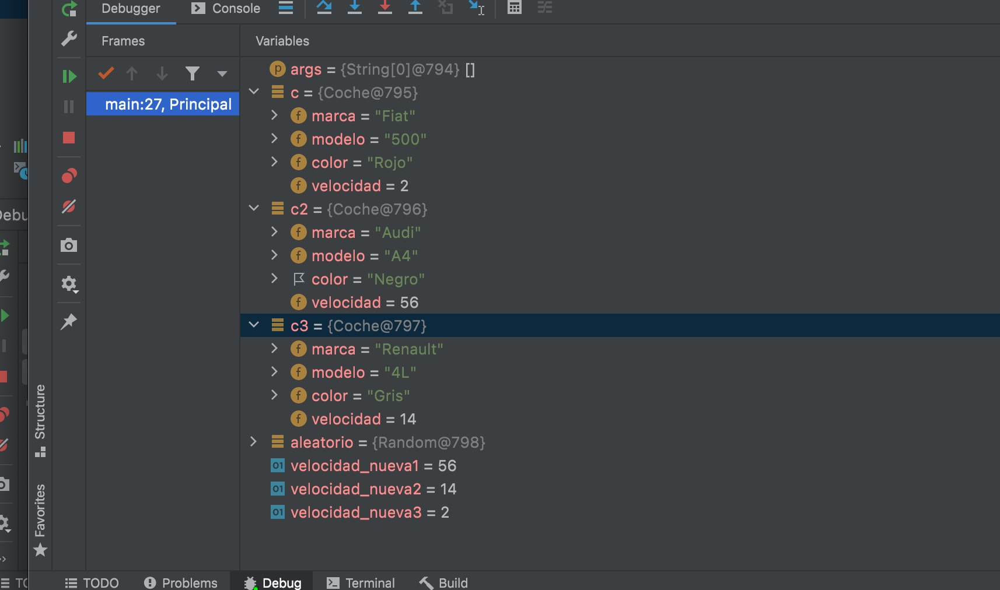
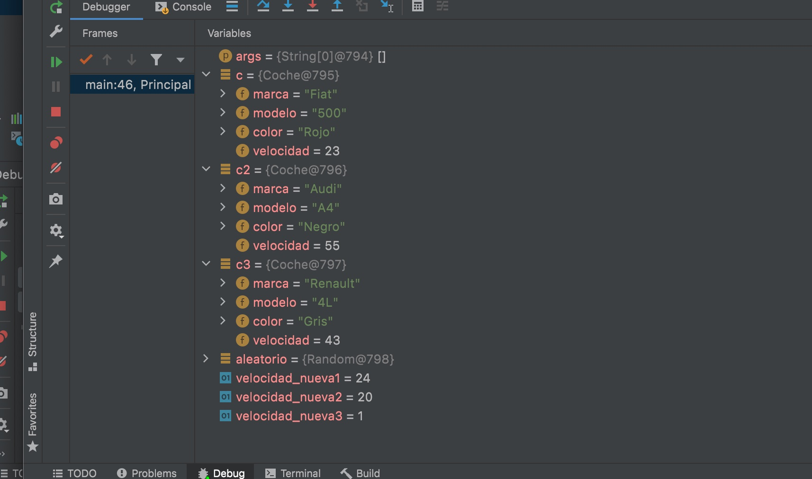

## Tasca Depuracion

### Método MAIN

- El método main es el punto de arranque del programa.

### Punto rotura 27

- Velocidad nueva1:56 Velocidad nueva2: 14 Velocidad nueva3:2
- Coche c:"Fiat", "500", "Rojo", Velocidad:2
- Coche c2:"Audi", "A4", "Negro",velocidad:56
- Coche c3:"Renault","4L", "Gris", velocidad:14
  

### Punto rotura 46 Después de frenar

- Velocidad nueva1:24 Velocidad nueva2: 20 Velocidad nueva3:1
- Coche c:"Fiat", "500", "Rojo", Velocidad:23
- Coche c2:"Audi", "A4", "Negro",velocidad:55
- Coche c3:"Renault","4L", "Gris", velocidad:43
  
